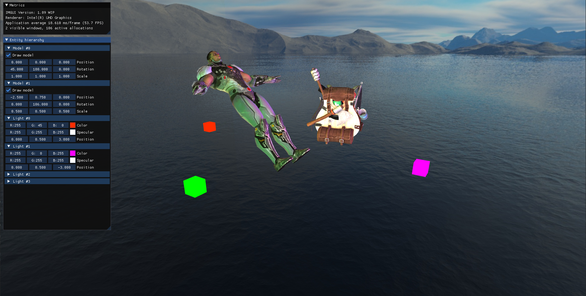

# Division
An OpenGL 3D game engine for my Games Programming course.

View the demo reel [here](https://www.youtube.com/watch?v=yFDST90T3v4).

## Features
- Lighting maps (diffuse & specular)
- Multiple light casters
- Loading and rendering 3D models
- Transformation hierarchy
- Cubemaps
